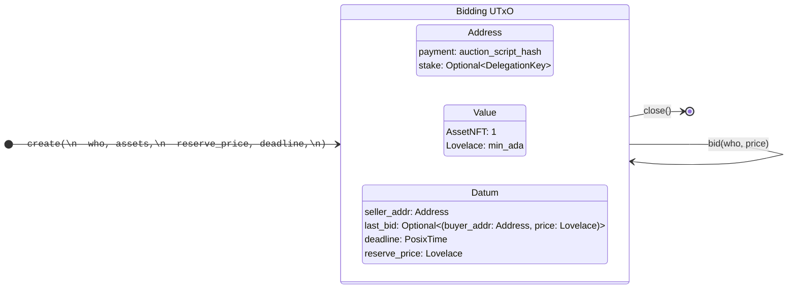

# english-auction

An education project that implements a simple auction contract on Cardano

## Auction Smart Contract



## Building

```sh
aiken build
```

## Testing

To run all tests, simply do:

```sh
aiken check
```

To run only tests matching the string `foo`, do:

```sh
aiken check -m foo
```

## Resources

Find more on the [Aiken's user manual](https://aiken-lang.org).
